# 
Getting Started with Golioth and FOTA on ST Boards

####  
Can be visited here*: https://golioth.io/

In essence, Golioth, is an online dashboard (which can be controlled via CLI) that gives us live feedback from a device and can allow firmware updates. We can control firmware versions for multiple devices and their release.

### 
Golioth

------

This section is a tutorial on Golioth. I will demonstrate how to create a project, virtual device and how it connects with a board, in my case the B-L475E-IOT01A from ST (name disco_l475_iot1 on Zephyr RTOS).

- First, let's start with the Home dashboard. 

  At first we are directed on the Home page, which shows our created projects. 

  A project is needed in order to compartmentalize our devices and the projects that they are connected to.

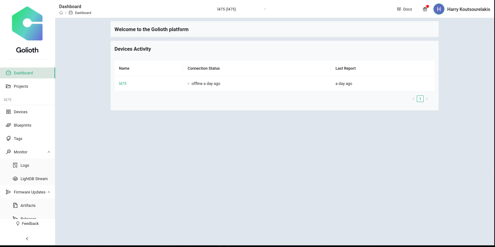

- If we go to Projects on the left it will show further details of our projects.

  We can create a project by pressing "Create" on the top right. I can't create a new one, since Golioth allows only one project outside of commercial use.

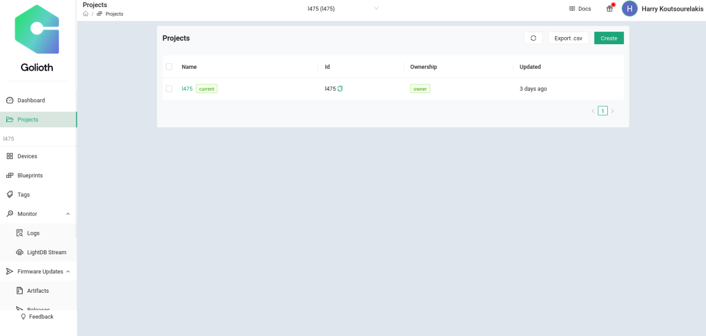

- Before we create a Device, we will create a Blueprint.

  Blueprints are Golioth way of checking whether our device is supported out-of-box and can be selected if we have many identical devices.

  Here we can seethe Blueprint I created for the L475 board.

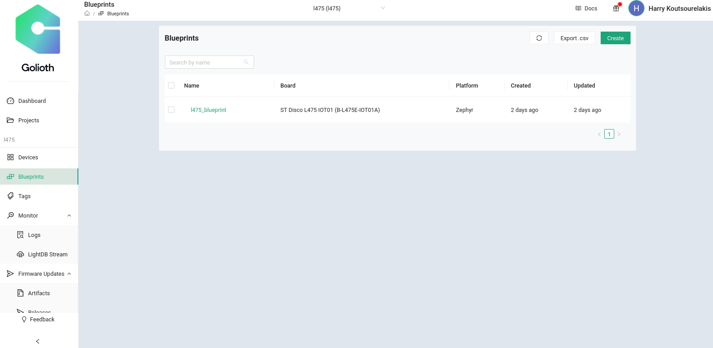

- And here we can see a few of the plethora of devices.

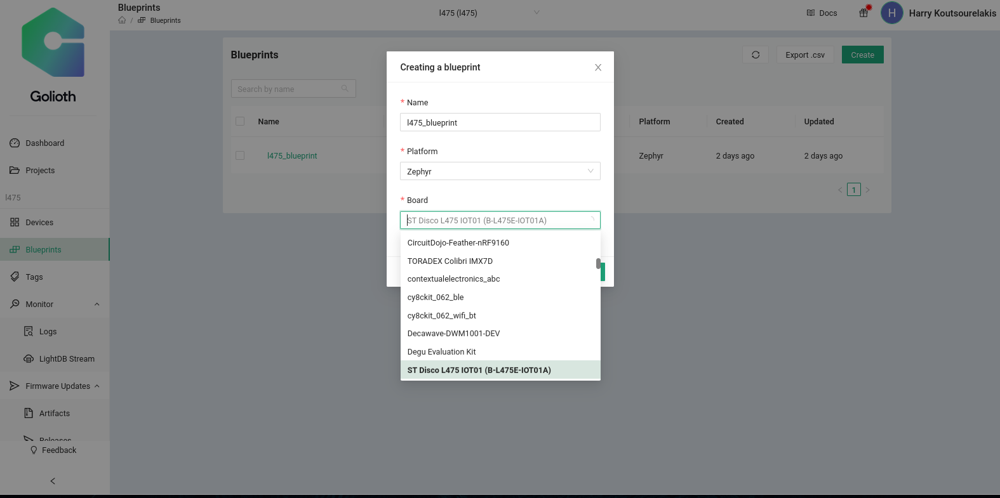

- Moving on to devices.

  Here is the interface that shows the devices we have created.

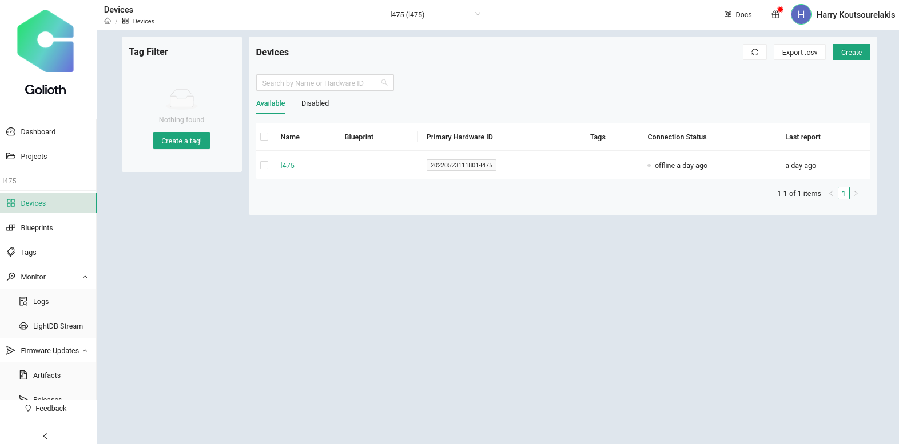

- Let's create a device.

  After selecting "Create", we can :

  1. Name our device,
  2. Select a Tag, I haven't created one here, (optional),
  3. Select the Blueprint we created earlier (optional),
  4. Create our own Hardware ID if we don't want it created automatically and
  5. Create a PSK (we can create our own or let the platform generate one).

  Here I will create my own Identity for the device and PSK:

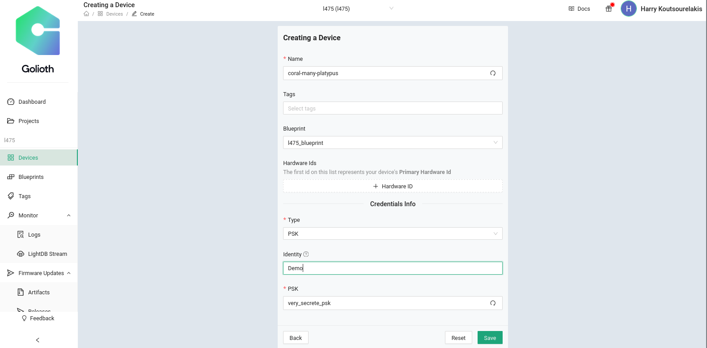

- After the creation of the device we receive the following window, containing our Credentials we created:

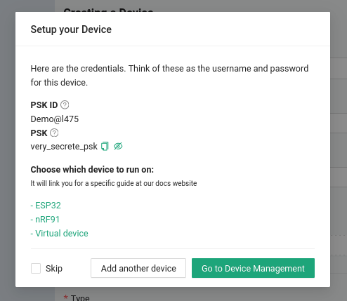

- If we choose to redirect to "Device Management" we will be greeted with the following information:

  Here we can access:

  - The Credentials of the device,
  - the Firmware version (we will add it later),
  - LightDB Database State and Stream and
  - the Logs of any running program.

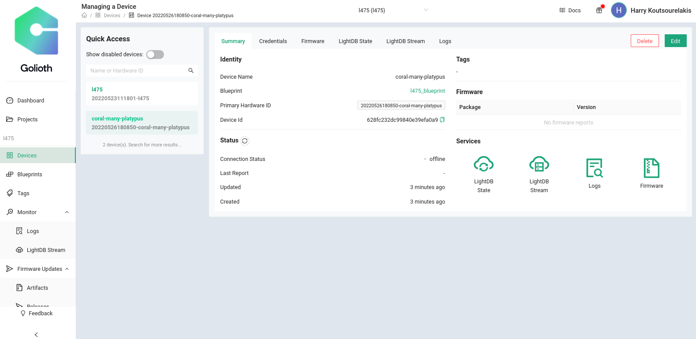

- Now let's move on to build a project on Zephyr and connect it with Golioth.

------

# 
Build a Project on Zephyr RTOS with Golioth

In order to build a project for Golioth we need to  install the Golioth SDK for Zephyr first.

Instructions are straightforward and can be found on the Github repository of Golioth:

https://github.com/golioth/golioth-zephyr-sdk

### Building and flashing a simple Hello project.

 After this project is built, we will be able to see the UART logs on the Golioth Dashboard.

1. First we need to go to the Golioth directory. In my case it is in

   ​		`~/zephyrproject/modules/lib/golioth`

2. Before we start building we need to take a look into the `prj.conf` file to enable the WiFi, and add the credentials we created earlier.

3. We move to ``~/zephyrproject/modules/lib/golioth/samples/hello` and open the `prj.conf` file.

   Let's take a closer look to the configurations:
	 

	##### Generic networking options

	CONFIG_NETWORKING=y
	CONFIG_NET_IPV4=y
	CONFIG_NET_IPV6=n

	##### Logging
	CONFIG_NET_LOG=y

	##### Network Shell

	CONFIG_NET_SHELL=y

	##### TLS configuration

	CONFIG_MBEDTLS_ENABLE_HEAP=y
	CONFIG_MBEDTLS_HEAP_SIZE=10240
	CONFIG_MBEDTLS_SSL_MAX_CONTENT_LEN=2048

	##### Application
	CONFIG_MAIN_STACK_SIZE=4096

	CONFIG_GOLIOTH=y
	CONFIG_GOLIOTH_SYSTEM_CLIENT=y

	CONFIG_MINIMAL_LIBC_MALLOC_ARENA_SIZE=256

	CONFIG_LOG_BACKEND_GOLIOTH=y
	CONFIG_LOG_PROCESS_THREAD_STACK_SIZE=2048

	##### Configurations for the L475 board

	CONFIG_WIFI=y			  	#Enables the wifi
	CONFIG_WIFI_ESP_AT=y		  	# Espressif AT Command support 
	CONFIG_WIFI_ESP_AT_MDM_RX_BUF_COUNT=40 # Modem RX buffer count

	CONFIG_NET_L2_WIFI_SHELL=y 		# Enable Wi-Fi shell module
	CONFIG_GOLIOTH_SAMPLE_WIFI=y		# Golioth's wifi module

	CONFIG_GOLIOTH_SYSTEM_CLIENT_PSK_ID="Demo@l475"
	CONFIG_GOLIOTH_SYSTEM_CLIENT_PSK="very_secrete_psk"

	CONFIG_GOLIOTH_SAMPLE_WIFI_SSID="<ssid>"
	CONFIG_GOLIOTH_SAMPLE_WIFI_PSK="<psk>"

	   

4. Let's build our project:

   `west build -b disco_l475_iot1 samples/hello -- -DSHIELD=esp_8266_arduino`

   Notice that I use an external shield parameter for the ESP8266 01 instead of the integrated wifi module of my board, because I haven't found a solution to get it working as of now.
	 
			 
		┌─[✗]─[harrkout@rth]─[~/modules/lib/golioth]``
		└──╼ $ west build -b disco_l475_iot1 samples/hello -p -- -DSHIELD=esp_8266_arduino
		-- west build: making build dir /home/harrkout/modules/lib/golioth/build pristine
		-- west build: generating a build system
		Including boilerplate (Zephyr base): /home/harrkout/zephyr/cmake/app/boilerplate.cmake
		-- Application: /home/harrkout/modules/lib/golioth/samples/hello
		-- Zephyr version: 2.7.99 (/home/harrkout/zephyr), build: v2.7.99-3661-gd51a67b7c098
		-- Found Python3: /usr/bin/python3.10 (found suitable exact version "3.10.4") found components: Interpreter 
		-- Found west (found suitable version "0.13.1", minimum required is "0.7.1")
		-- Board: disco_l475_iot1, Shield(s): esp_8266_arduino
		-- Cache files will be written to: /home/harrkout/.cache/zephyr
		-- ZEPHYR_TOOLCHAIN_VARIANT not set, trying to locate Zephyr SDK
		-- Found host-tools: zephyr 0.14.1 (/opt/zephyr-sdk)
		-- Found dtc: /opt/zephyr-sdk/sysroots/x86_64-pokysdk-linux/usr/bin/dtc (found suitable version "1.6.0", minimum required is "1.4.6")
		-- Found toolchain: zephyr 0.14.1 (/opt/zephyr-sdk)
		-- Found BOARD.dts: /home/harrkout/zephyr/boards/arm/disco_l475_iot1/disco_l475_iot1.dts
		-- Found devicetree overlay: /home/harrkout/zephyr/boards/shields/esp_8266/esp_8266_arduino.overlay
		-- Found devicetree overlay: /home/harrkout/modules/lib/golioth/samples/hello/boards/disco_l475_iot1.overlay
		-- Generated zephyr.dts: /home/harrkout/modules/lib/golioth/build/zephyr/zephyr.dts
		-- Generated devicetree_unfixed.h: /home/harrkout/modules/lib/golioth/build/zephyr/include/generated/devicetree_unfixed.h
		-- Generated device_extern.h: /home/harrkout/modules/lib/golioth/build/zephyr/include/generated/device_extern.h
		-- Including generated dts.cmake file: /home/harrkout/modules/lib/golioth/build/zephyr/dts.cmake
		Parsing /home/harrkout/modules/lib/golioth/samples/hello/Kconfig
		Loaded configuration '/home/harrkout/zephyr/boards/arm/disco_l475_iot1/disco_l475_iot1_defconfig'
		Merged configuration '/home/harrkout/modules/lib/golioth/samples/hello/prj.conf'
		Configuration saved to '/home/harrkout/modules/lib/golioth/build/zephyr/.config'
		Kconfig header saved to '/home/harrkout/modules/lib/golioth/build/zephyr/include/generated/autoconf.h'
		-- The C compiler identification is GNU 10.3.0
		-- The CXX compiler identification is GNU 10.3.0
		-- The ASM compiler identification is GNU
		-- Found assembler: /opt/zephyr-sdk/arm-zephyr-eabi/bin/arm-zephyr-eabi-gcc
		CMake Warning at /home/harrkout/zephyr/CMakeLists.txt:763 (message):
		No SOURCES given to Zephyr library: subsys__net__pkt_filter
		Excluding target from build.

		-- Configuring done
		-- Generating done
		-- Build files have been written to: /home/harrkout/modules/lib/golioth/build
		-- west build: building application
		[1/327] Preparing syscall dependency handling
		[317/327] Linking C executable zephyr/zephyr_pre0.elf
		[321/327] Linking C executable zephyr/zephyr_pre1.elf
		[327/327] Linking C executable zephyr/zephyr.elf
		Memory region         Used Size  Region Size  %age Used
										FLASH:      202380 B         1 MB     19.30%
										SRAM:       58399 B        96 KB     59.41%
										IDT_LIST:          0 GB         2 KB      0.00%

5. Flashing:

		west flash
		-- west flash: rebuilding
		ninja: no work to do.
		-- west flash: using runner openocd
		-- runners.openocd: Flashing file: /home/harrkout/modules/lib/golioth/build/zephyr/zephyr.hex
		Open On-Chip Debugger 0.11.0+dev-00244-g7e3dbbbe2 (2022-04-11-19:33)
		Licensed under GNU GPL v2
		For bug reports, read
		http://openocd.org/doc/doxygen/bugs.html
		Info : The selected transport took over low-level target control. The results might differ compared to plain JTAG/SWD
		Info : DEPRECATED target event trace-config
		srst_only separate srst_nogate srst_open_drain connect_deassert_srst

		Info : clock speed 500 kHz
		Info : STLINK V2J39M27 (API v2) VID:PID 0483:374B
		Info : Target voltage: 3.213184
		Info : stm32l4x.cpu: hardware has 6 breakpoints, 4 watchpoints
		Info : starting gdb server for stm32l4x.cpu on 3333
		Info : Listening on port 3333 for gdb connections
				TargetName         Type       Endian TapName            State       

				--  ------------------ ---------- ------ ------------------ ------------

				0* stm32l4x.cpu       hla_target little stm32l4x.cpu       running

		Info : Unable to match requested speed 500 kHz, using 480 kHz
		Info : Unable to match requested speed 500 kHz, using 480 kHz
		target halted due to debug-request, current mode: Thread 
		xPSR: 0x01000000 pc: 0x08007a18 msp: 0x2000a4a0
		Info : device idcode = 0x10076415 (STM32L47/L48xx - Rev 4 : 0x1007 - Flash single-bank)
		Info : RDP level 0 (0xAA)
		Info : flash size = 1024kbytes
		Info : flash mode : dual-bank
		Warn : Adding extra erase range, 0x08031690 .. 0x080317ff
		auto erase enabled
		wrote 202384 bytes from file /home/harrkout/modules/lib/golioth/build/zephyr/zephyr.hex in 8.696055s (22.728 KiB/s)

		Info : Unable to match requested speed 500 kHz, using 480 kHz
		Info : Unable to match requested speed 500 kHz, using 480 kHz
		target halted due to debug-request, current mode: Thread 
		xPSR: 0x01000000 pc: 0x08007a18 msp: 0x2000a4a0
		verified 202384 bytes in 5.817580s (33.973 KiB/s)

		Info : Unable to match requested speed 500 kHz, using 480 kHz
		Info : Unable to match requested speed 500 kHz, using 480 kHz
		shutdown command invoked

6. Serial output:

		uart:~$ *** Booting Zephyr OS build v2.7.99-3661-gd51a67b7c098  ***
		[00:00:00.378,000] <inf> golioth_system: Initializing
		[00:00:00.378,000] <dbg> golioth_hello: main: Start Hello sample
		[00:00:00.378,000] <inf> golioth_hello: Connecting to WiFi
		[00:00:00.378,000] <err> golioth_wifi: Failed to request WiFi connect: -5
		[00:00:00.745,000] <inf> wifi_esp_at: ESP Wi-Fi ready
		uart:~$ Connected
		[00:00:08.452,000] <dbg> golioth_wifi: wifi_mgmt_event_handler: wifi event: d1560003
		[00:00:08.453,000] <inf> golioth_wifi: Successfully connected to WiFi
		[00:00:08.453,000] <inf> golioth_hello: Sending Hello: 0
		[00:00:08.453,000] <wrn> golioth_hello: Failed to send hello!
		[00:00:08.453,000] <inf> golioth_system: Starting connect
		[00:00:13.453,000] <inf> golioth_hello: Sending Hello: 1
		[00:00:13.454,000] <wrn> golioth_hello: Failed to send hello!
		[00:00:14.413,000] <err> golioth: Fail to get address (coap.golioth.io 5684) -101
		[00:00:14.413,000] <err> golioth_system: Failed to connect: -11
		[00:00:14.413,000] <wrn> golioth_system: Failed to connect: -11
		[00:00:18.454,000] <inf> golioth_hello: Sending Hello: 2
		[00:00:18.454,000] <wrn> golioth_hello: Failed to send hello!
		[00:00:19.413,000] <inf> golioth_system: Starting connect
		[00:00:19.490,000] <inf> golioth_system: Client connected!
		[00:00:23.454,000] <inf> golioth_hello: Sending Hello: 3
		[00:00:28.458,000] <inf> golioth_hello: Sending Hello: 4
		[00:00:33.462,000] <inf> golioth_hello: Sending Hello: 5
		[00:00:38.465,000] <inf> golioth_hello: Sending Hello: 6

7. Now let's see the Logs on the Golioth Dashboard:

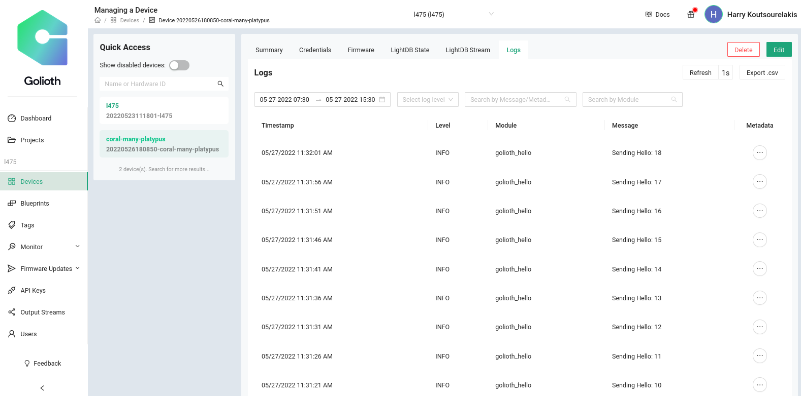

   Everything seems to work perfectly.

### 
Building the DFU Project of Golioth

- The DFU sample of Golioth shows a very generic way on how FOTA works and how firmware versions can be controlled and released.

- **How Device Firmware Update works (DFU)**

1. First we need to build and flash the bootloader into the board.

2. Then we build a project on `~/modules/lib/golioth`.

3. Before we flash the project, we need to create a signed image of our built project and flash it.
   This way, our flashed project contains a hex key that can be used by the update images to ensure encryption.

   `Sidenote here: The bootloader restarts in order to get the signed image`

4. Now we can create a new artifact (Firmware) based on the signed image we created and flashed.

5. After that we can create a release for our artifact and enable it whenever we want it pushed onto the device.

- **Demo**

		1. 		┌─[harrkout@rth]─[~]
		└──╼ $ cd zephyrproject/bootloader/mcuboot/
		┌─[harrkout@rth]─[~/zephyrproject/bootloader/mcuboot]
		└──╼ $  west build -s boot/zephyr -b disco_l475_iot1 -p
		-- west build: making build dir /home/harrkout/zephyrproject/bootloader/mcuboot/build pristine
		-- west build: generating a build system
		Loading Zephyr default modules (Zephyr base).
		-- Application: /home/harrkout/zephyrproject/bootloader/mcuboot/boot/zephyr
		-- Found Python3: /usr/bin/python3.10 (found suitable exact version "3.10.4") found components: Interpreter 
		-- Cache files will be written to: /home/harrkout/.cache/zephyr
		-- Zephyr version: 3.0.99 (/home/harrkout/zephyrproject/zephyr)
		-- Found west (found suitable version "0.13.1", minimum required is "0.7.1")
		-- Board: disco_l475_iot1
		-- ZEPHYR_TOOLCHAIN_VARIANT not set, trying to locate Zephyr SDK
		-- Found host-tools: zephyr 0.14.1 (/opt/zephyr-sdk)
		-- Found dtc: /opt/zephyr-sdk/sysroots/x86_64-pokysdk-linux/usr/bin/dtc (found suitable version "1.6.0", minimum required is "1.4.6")
		-- Found toolchain: zephyr 0.14.1 (/opt/zephyr-sdk)
		-- Found BOARD.dts: /home/harrkout/zephyrproject/zephyr/boards/arm/disco_l475_iot1/disco_l475_iot1.dts
		-- Found devicetree overlay: /home/harrkout/zephyrproject/bootloader/mcuboot/boot/zephyr/dts.overlay
		-- Generated zephyr.dts: /home/harrkout/zephyrproject/bootloader/mcuboot/build/zephyr/zephyr.dts
		-- Generated devicetree_unfixed.h: /home/harrkout/zephyrproject/bootloader/mcuboot/build/zephyr/include/generated/devicetree_unfixed.h
		-- Generated device_extern.h: /home/harrkout/zephyrproject/bootloader/mcuboot/build/zephyr/include/generated/device_extern.h
		-- Including generated dts.cmake file: /home/harrkout/zephyrproject/bootloader/mcuboot/build/zephyr/dts.cmake
		Parsing /home/harrkout/zephyrproject/bootloader/mcuboot/boot/zephyr/Kconfig
		Loaded configuration '/home/harrkout/zephyrproject/zephyr/boards/arm/disco_l475_iot1/disco_l475_iot1_defconfig'
		Merged configuration '/home/harrkout/zephyrproject/bootloader/mcuboot/boot/zephyr/prj.conf'
		Merged configuration '/home/harrkout/zephyrproject/bootloader/mcuboot/boot/zephyr/boards/disco_l475_iot1.conf'
		Configuration saved to '/home/harrkout/zephyrproject/bootloader/mcuboot/build/zephyr/.config'
		Kconfig header saved to '/home/harrkout/zephyrproject/bootloader/mcuboot/build/zephyr/include/generated/autoconf.h'
		-- The C compiler identification is GNU 10.3.0
		-- The CXX compiler identification is GNU 10.3.0
		-- The ASM compiler identification is GNU
		-- Found assembler: /opt/zephyr-sdk/arm-zephyr-eabi/bin/arm-zephyr-eabi-gcc
		MCUBoot bootloader key file: /home/harrkout/zephyrproject/bootloader/mcuboot/root-rsa-2048.pem
		-- Configuring done
		-- Generating done
		-- Build files have been written to: /home/harrkout/zephyrproject/bootloader/mcuboot/build
		-- west build: building application
		[1/282] Preparing syscall dependency handling

		[3/282] Generating include/generated/version.h
		-- Zephyr version: 3.0.99 (/home/harrkout/zephyrproject/zephyr), build: zephyr-v3.0.0-3352-gf6069aa8fa35
		[272/282] Linking C executable zephyr/zephyr_pre0.elf

		[276/282] Linking C executable zephyr/zephyr_pre1.elf

		[282/282] Linking C executable zephyr/zephyr.elf
		Memory region         Used Size  Region Size  %age Used
								FLASH:       50820 B        64 KB     77.55%
								SRAM:       33920 B        96 KB     34.51%
								IDT_LIST:          0 GB         2 KB      0.00%

----------------
		2.
		┌─[harrkout@rth]─[~/zephyrproject/bootloader/mcuboot]
		└──╼ $ west flash
		-- west flash: rebuilding
		ninja: no work to do.
		-- west flash: using runner openocd
		-- runners.openocd: Flashing file: /home/harrkout/zephyrproject/bootloader/mcuboot/build/zephyr/zephyr.hex
		Open On-Chip Debugger 0.11.0+dev-00244-g7e3dbbbe2 (2022-04-11-19:33)
		Licensed under GNU GPL v2
		For bug reports, read
		http://openocd.org/doc/doxygen/bugs.html
		Info : The selected transport took over low-level target control. The results might differ compared to plain JTAG/SWD
		Info : DEPRECATED target event trace-config
		srst_only separate srst_nogate srst_open_drain connect_deassert_srst

		Info : clock speed 500 kHz
		Info : STLINK V2J39M27 (API v2) VID:PID 0483:374B
		Info : Target voltage: 3.211067
		Warn : target stm32l4x.cpu examination failed
		Error: jtag status contains invalid mode value - communication failure
		Polling target stm32l4x.cpu failed, trying to reexamine
		Examination failed, GDB will be halted. Polling again in 100ms
		Info : Previous state query failed, trying to reconnect
		Error: jtag status contains invalid mode value - communication failure
		Polling target stm32l4x.cpu failed, trying to reexamine
		Examination failed, GDB will be halted. Polling again in 300ms
		Info : starting gdb server for stm32l4x.cpu on 3333
		Info : Listening on port 3333 for gdb connections
					TargetName         Type       Endian TapName            State       

					--  ------------------ ---------- ------ ------------------ ------------

					0* stm32l4x.cpu       hla_target little stm32l4x.cpu       unknown

		Info : Unable to match requested speed 500 kHz, using 480 kHz
		Info : Unable to match requested speed 500 kHz, using 480 kHz
		Error: mem2array: Read @ 0xe0042004, w=4, cnt=1, failed
		Error executing event examine-end on target stm32l4x.cpu:
		/opt/zephyr-sdk/sysroots/x86_64-pokysdk-linux/usr/share/openocd/scripts/mem_helper.tcl:6: Error: 
		in procedure 'ocd_process_reset' 
		in procedure 'ocd_process_reset_inner' called at file "embedded:startup.tcl", line 260
		in procedure 'mmw' called at file "/opt/zephyr-sdk/sysroots/x86_64-pokysdk-linux/usr/share/openocd/scripts/target/stm32l4x.cfg", line 108
		in procedure 'mrw' called at file "/opt/zephyr-sdk/sysroots/x86_64-pokysdk-linux/usr/share/openocd/scripts/mem_helper.tcl", line 36
		at file "/opt/zephyr-sdk/sysroots/x86_64-pokysdk-linux/usr/share/openocd/scripts/mem_helper.tcl", line 6
		Info : Previous state query failed, trying to reconnect
		target halted due to debug-request, current mode: Thread 
		xPSR: 0x01000000 pc: 0x08007a18 msp: 0x2000a4a0
		Polling target stm32l4x.cpu failed, trying to reexamine
		Info : stm32l4x.cpu: hardware has 6 breakpoints, 4 watchpoints
		Info : device idcode = 0x10076415 (STM32L47/L48xx - Rev 4 : 0x1007 - Flash single-bank)
		Info : RDP level 0 (0xAA)
		Info : flash size = 1024kbytes
		Info : flash mode : dual-bank
		Info : Padding image section 0 at 0x0800c684 with 4 bytes (bank write end alignment)
		Warn : Adding extra erase range, 0x0800c688 .. 0x0800c7ff
		auto erase enabled
		wrote 50824 bytes from file /home/harrkout/zephyrproject/bootloader/mcuboot/build/zephyr/zephyr.hex in 2.330193s (21.300 KiB/s)

		Info : Unable to match requested speed 500 kHz, using 480 kHz
		Info : Unable to match requested speed 500 kHz, using 480 kHz
		target halted due to debug-request, current mode: Thread 
		xPSR: 0x01000000 pc: 0x08002060 msp: 0x20007a80
		verified 50820 bytes in 1.519404s (32.663 KiB/s)

		Info : Unable to match requested speed 500 kHz, using 480 kHz
		Info : Unable to match requested speed 500 kHz, using 480 kHz
		shutdown command invoked

3. Serial output:

		uart:~$ I: MX25R6435F: SFDP v 1.6 AP ff with 3 PH
		I: PH0: ff00 rev 1.6: 16 DW @ 30
		I: MX25R6435F: 8 MiBy flash
		I: PH1: ffc2 rev 1.0: 4 DW @ 110
		I: Device MX25R6435F initialized
		*** Booting Zephyr OS build zephyr-v3.0.0-3352-gf6069aa8fa35  ***
		I: Starting bootloader
		I: Primary image: magic=good, swap_type=0x2, copy_done=0x1, image_ok=0x1
		I: Scratch: magic=unset, swap_type=0x1, copy_done=0x3, image_ok=0x3
		I: Boot source: none
		I: Swap type: none
		E: Image in the primary slot is not valid!
		E: Unable to find bootable image

   

4. ​	`west build -b disco_l475_iot1 samples/dfu -p -- -DSHIELD=esp_8266_arduino`

-----------
		5.
		┌─[✗]─[harrkout@rth]─[~/modules/lib/golioth]
		└──╼ $  west sign -t imgtool -- --key ~/zephyrproject/bootloader/mcuboot/root-rsa-2048.pem
		=== image configuration:
		partition offset: 131072 (0x20000)
		partition size: 884736 (0xd8000)
		rom start offset: 512 (0x200)
		=== signing binaries
		unsigned bin: /home/harrkout/modules/lib/golioth/build/zephyr/zephyr.bin
		signed bin:   /home/harrkout/modules/lib/golioth/build/zephyr/zephyr.signed.bin
		unsigned hex: /home/harrkout/modules/lib/golioth/build/zephyr/zephyr.hex
		signed hex:   /home/harrkout/modules/lib/golioth/build/zephyr/zephyr.signed.hex

   
   
-----------

		6.
		┌─[harrkout@rth]─[~/modules/lib/golioth]
		└──╼ $  west flash --bin-file build/zephyr/zephyr.signed.bin --hex-file build/zephyr/zephyr.signed.hex
		-- west flash: rebuilding
		ninja: no work to do.
		-- west flash: using runner openocd
		-- runners.openocd: Flashing file: build/zephyr/zephyr.signed.hex
		Open On-Chip Debugger 0.11.0+dev-00244-g7e3dbbbe2 (2022-04-11-19:33)
		Licensed under GNU GPL v2
		For bug reports, read
		http://openocd.org/doc/doxygen/bugs.html
		Info : The selected transport took over low-level target control. The results might differ compared to plain JTAG/SWD
		Info : DEPRECATED target event trace-config
		srst_only separate srst_nogate srst_open_drain connect_deassert_srst

		Info : clock speed 500 kHz
		Info : STLINK V2J39M27 (API v2) VID:PID 0483:374B
		Info : Target voltage: 3.211067
		Info : stm32l4x.cpu: hardware has 6 breakpoints, 4 watchpoints
		Info : starting gdb server for stm32l4x.cpu on 3333
		Info : Listening on port 3333 for gdb connections
				TargetName         Type       Endian TapName            State 

				--  ------------------ ---------- ------ ------------------ ------------

					0* stm32l4x.cpu       hla_target little stm32l4x.cpu       running

		Info : Unable to match requested speed 500 kHz, using 480 kHz
		Info : Unable to match requested speed 500 kHz, using 480 kHz
		target halted due to debug-request, current mode: Thread 
		xPSR: 0x01000000 pc: 0x08002060 msp: 0x20007a80
		Info : device idcode = 0x10076415 (STM32L47/L48xx - Rev 4 : 0x1007 - Flash single-bank)
		Info : RDP level 0 (0xAA)
		Info : flash size = 1024kbytes
		Info : flash mode : dual-bank
		Warn : Adding extra erase range, 0x08058430 .. 0x080587ff
		auto erase enabled
		wrote 230448 bytes from file build/zephyr/zephyr.signed.hex in 9.923305s (22.679 KiB/s)

		Info : Unable to match requested speed 500 kHz, using 480 kHz
		Info : Unable to match requested speed 500 kHz, using 480 kHz
		target halted due to debug-request, current mode: Thread 
		xPSR: 0x01000000 pc: 0x08002060 msp: 0x20007a80
		verified 230448 bytes in 6.609408s (34.049 KiB/s)

		Info : Unable to match requested speed 500 kHz, using 480 kHz
		Info : Unable to match requested speed 500 kHz, using 480 kHz
		shutdown command invoked

-----------

		7. Serial output:

			uart:~$ I: MX25R6435F: SFDP v 1.6 AP ff with 3 PH
			I: PH0: ff00 rev 1.6: 16 DW @ 30
			I: MX25R6435F: 8 MiBy flash
			I: PH1: ffc2 rev 1.0: 4 DW @ 110
			I: Device MX25R6435F initialized

			*** Booting Zephyr OS build zephyr-v3.0.0-3352-gf6069aa8fa35  ***
			I: Starting bootloader
			I: Primary image: magic=good, swap_type=0x2, copy_done=0x1, image_ok=0x1
			I: Scratch: magic=unset, swap_type=0x1, copy_done=0x3, image_ok=0x3
			I: Boot source: none
			I: Swap type: none
			I: Bootloader chainload address offset: 0x20000
			I: Jumping to the first image slot

			*** Booting Zephyr OS build v2.7.99-3661-gd51a67b7c098  ***

			[00:00:00.001,000] <inf> flash_stm32_qspi: MX25R6435F: SFDP v 1.6 AP ff with 3 PH
			[00:00:00.001,000] <inf> flash_stm32_qspi: PH0: ff00 rev 1.6: 16 DW @ 30
			[00:00:00.001,000] <inf> flash_stm32_qspi: MX25R6435F: 8 MiBy flash
			[00:00:00.001,000] <inf> flash_stm32_qspi: PH1: ffc2 rev 1.0: 4 DW @ 110
			[00:00:00.001,000] <inf> flash_stm32_qspi: Device MX25R6435F initialized
			[00:00:00.005,000] <wrn> wifi_esp_at: Busy processing
			[00:00:00.008,000] <inf> golioth_system: Initializing
			[00:00:00.009,000] <dbg> golioth_dfu: main: Start DFU sample
			[00:00:00.009,000] <inf> golioth_dfu: Connecting to WiFi
			[00:00:00.009,000] <err> golioth_wifi: Failed to request WiFi connect: -5
			uart:~$ Connected
			[00:00:02.446,000] <dbg> golioth_wifi: wifi_mgmt_event_handler: wifi event: d1560003
			[00:00:05.009,000] <err> golioth_wifi: Failed to request WiFi connect: -5
			[00:00:10.009,000] <err> golioth_wifi: Failed to request WiFi connect: -5
			[00:00:10.163,000] <err> modem_cmd_handler: command AT+CWMODE_CUR=1 ret:-116
			[00:00:10.163,000] <err> wifi_esp_at: Init failed -116
			[00:00:10.535,000] <inf> wifi_esp_at: ESP Wi-Fi ready
			[00:00:15.009,000] <inf> golioth_wifi: Already connected to WiFi
			[00:00:15.009,000] <inf> golioth_system: Starting connect
			[00:00:15.879,000] <inf> golioth_system: Client connected!
			[00:00:16.100,000] <dbg> golioth_dfu: golioth_desired_update: Desired
																					 a3 01 1a 62 8d 14 17 02  78 40 38 32 30 65 61 32 |...b.... x@820ea2
																					 39 33 37 30 37 62 38 63  36 38 61 62 32 35 31 64 |93707b8c 68ab251d
																					 39 34 38 39 64 33 34 63  65 32 33 38 35 61 65 33 |9489d34c e2385ae3
																					 61 35 63 37 36 62 32 36  62 63 31 37 66 33 36 37 |a5c76b26 bc17f367
																					 61 31 65 37 38 62 61 61  63 33 03 81 a6 01 63 6e |a1e78baa c3....cn
																					 65 77 02 66 31 2e 30 2e  31 30 03 78 40 34 35 38 |ew.f1.0. 10.x@458
																					 39 38 65 32 35 34 63 39  63 66 39 65 61 63 31 31 |98e254c9 cf9eac11
																					 38 61 65 37 36 38 63 64  39 65 64 65 35 31 66 63 |8ae768cd 9ede51fc
																					 39 34 34 62 64 66 31 61  32 32 37 62 37 62 34 30 |944bdf1a 227b7b40
																					 36 37 32 37 64 63 64 33  64 39 64 37 61 04 1a 00 |6727dcd3 d9d7a...
																					 03 80 d8 05 70 2f 2e 75  2f 63 2f 6e 65 77 40 31 |....p/.u /c/new@1
																					 2e 30 2e 31 30 06 67 6d  63 75 62 6f 6f 74       |.0.10.gm cuboot 
			[00:00:16.101,000] <inf> golioth: Manifest sequence-number: 1653412887

8. Side note: because the device we created belongs in the same project as my previous device, it automatically detects the firmware I created for the previously devices and upgrades it automatically.
   
   -----------

9. Create and sign the new firmware:

		west sign -t imgtool --no-hex -B demo.bin -- --key ~/zephyrproject/bootloader/mcuboot/root-rsa-2048.pem --version 1.5.1
		=== image configuration:
		partition offset: 131072 (0x20000)
		partition size: 884736 (0xd8000)
		rom start offset: 512 (0x200)
		=== signing binaries
		unsigned bin: /home/harrkout/modules/lib/golioth/build/zephyr/zephyr.bin
		signed bin:   demo.bin

10. Creating a new artifact:

		[harrkout@rth]─[~/modules/lib/golioth/goliothctl]
		./goliothctl dfu artifact create ../demo.bin --version 1.5.1 --projectId l475id:"6290d394dc99840e39efa0b3"  version:"1.5.1"  package:"main"  size:230448 binaryInfo:map[digests:map[sha256:map[digest:b4cee0a2144d2ad4a36fcebe0e256fa23acb0ad6a3d1e12f1899f0e5fb972a17 size:32 type:sha256]] headerSize:512 imageSize:229600 tlvTotalSize:336 type:mcuboot version:1.5.1]

11. Create the release:

		./goliothctl dfu release create --release-tags 1.5.1 --components main@1.5.1id:"6290d407dc99840e39efa0b4"  release_tags:"1.5.1"  artifact_ids:"6290d394dc99840e39efa0b3"  sequence_number:1653658631803664362 suitManifest:{"authentication-wrapper":[{"algorithm-id":"sha256","digest-bytes":"194af5bb29a7d90a5b134ea7458c41fe307633564e89360b60725204cd150d64"}],"manifest":{"common":{"common-sequence":[{"id":"set-component-index","value":0},{"arg":{"class-id":"6a3ccea7-28a9-5ef1-8e0a-0fd3d58f61a4","image-digest":{"algorithm-id":"sha256","digest-bytes":"b4cee0a2144d2ad4a36fcebe0e256fa23acb0ad6a3d1e12f1899f0e5fb972a17"},"image-size":229600,"vendor-id":"36323862-3664-3431-6461-376532626234"},"id":"override-parameters"},{"id":"vendor-identifier","value":15},{"id":"class-identifier","value":15}],"components":[["main@1.5.1"]]},"install":[{"id":"set-component-index","value":0},{"arg":{"uri":"/.u/c/main@1.5.1"},"id":"set-parameters"},{"id":"fetch","value":2},{"id":"image-match","value":15}],"manifest-sequence-number":1653658631,"manifest-version":1,"run":[{"id":"set-component-index","value":0},{"id":"run","value":2}],"validate":[{"id":"set-component-index","value":0},{"id":"image-match","value":15}]}}

    

12. Here we can see the version 1.5.1 we created was uploaded on Golioth:

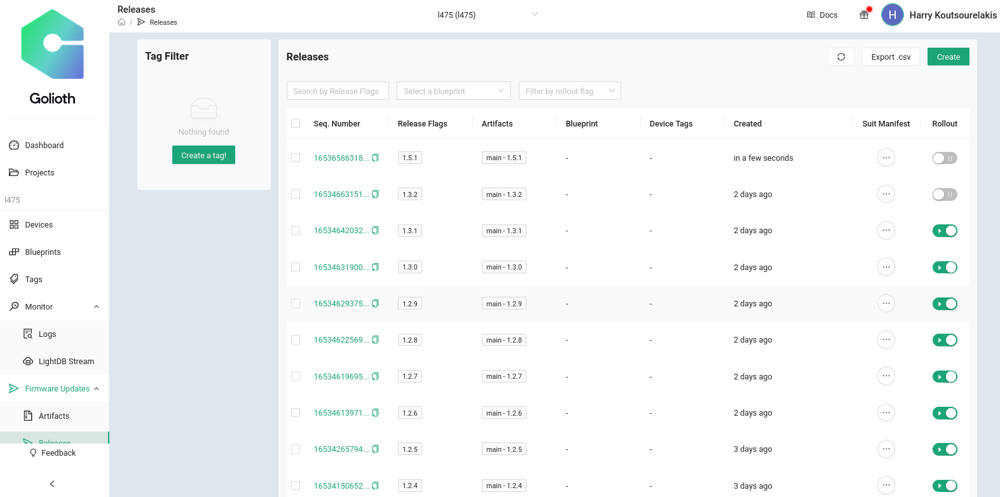

    

13. And according to the Rollout toggle button, our firmware has not been made public for the board to detect and receive it.

    If I enable the Rollout, let's see what happens:

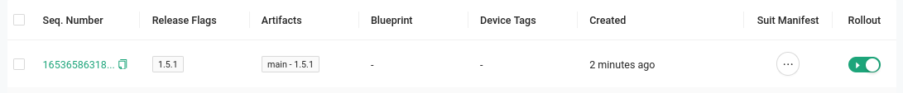

    

Serial Output:

		[00:14:01.608,000] <inf> golioth_dfu: Desired version (1.3.1) matches current firmware version!
		[00:16:28.143,000] <dbg> golioth_dfu: golioth_desired_update: Desired
																							a3 01 1a 62 90 d4 07 02  78 40 31 39 34 61 66 35 |...b.... x@194af5
																							62 62 32 39 61 37 64 39  30 61 35 62 31 33 34 65 |bb29a7d9 0a5b134e
																							61 37 34 35 38 63 34 31  66 65 33 30 37 36 33 33 |a7458c41 fe307633
																							35 36 34 65 38 39 33 36  30 62 36 30 37 32 35 32 |564e8936 0b607252
																							30 34 63 64 31 35 30 64  36 34 03 81 a6 01 64 6d |04cd150d 64....dm
																							61 69 6e 02 65 31 2e 35  2e 31 03 78 40 62 34 63 |ain.e1.5 .1.x@b4c
																							65 65 30 61 32 31 34 34  64 32 61 64 34 61 33 36 |ee0a2144 d2ad4a36
																							66 63 65 62 65 30 65 32  35 36 66 61 32 33 61 63 |fcebe0e2 56fa23ac
																							62 30 61 64 36 61 33 64  31 65 31 32 66 31 38 39 |b0ad6a3d 1e12f189
																							39 66 30 65 35 66 62 39  37 32 61 31 37 04 1a 00 |9f0e5fb9 72a17...
																							03 80 e0 05 70 2f 2e 75  2f 63 2f 6d 61 69 6e 40 |....p/.u /c/main@
																							31 2e 35 2e 31 06 67 6d  63 75 62 6f 6f 74       |1.5.1.gm cuboot  
		[00:16:28.143,000] <inf> golioth: Manifest sequence-number: 1653658631
		[00:16:28.648,000] <dbg> golioth_dfu: data_received: Received 1024 bytes at offset 0
		[00:16:28.648,000] <inf> mcuboot_util: Swap type: none
		[00:16:28.648,000] <inf> golioth_dfu: swap type: none
		[00:16:29.043,000] <dbg> golioth_dfu: data_received: Received 1024 bytes at offset 1024
		[00:16:29.347,000] <dbg> golioth_dfu: data_received: Received 1024 bytes at offset 2048
		[00:16:29.655,000] <dbg> golioth_dfu: data_received: Received 1024 bytes at offset 3072

    

It detected our version and is downloading it.

Bootloader reboots and checks integrity.

		uart:~$ I: MX25R6435F: SFDP v 1.6 AP ff with 3 PH
		I: PH0: ff00 rev 1.6: 16 DW @ 30
		I: MX25R6435F: 8 MiBy flash
		I: PH1: ffc2 rev 1.0: 4 DW @ 110
		I: Device MX25R6435F initialized
		*** Booting Zephyr OS build zephyr-v3.0.0-3352-gf6069aa8fa35  ***
		I: Starting bootloader
		I: Primary image: magic=good, swap_type=0x2, copy_done=0x1, image_ok=0x1
		I: Scratch: magic=unset, swap_type=0x1, copy_done=0x3, image_ok=0x3
		I: Boot source: none
		I: Swap type: test
		I: Starting swap using scratch algorithm.
		I: Bootloader chainload address offset: 0x20000
		I: Jumping to the first image slot

		[00:00:00.001,000] <inf> flash_stm32_qspi: MX25R6435F: SFDP v 1.6 AP ff with 3 PH
		[00:00:00.001,000] <inf> flash_stm32_qspi: PH0: ff00 rev 1.6: 16 DW @ 30
		[00:00:00.001,000] <inf> flash_stm32_qspi: MX25R6435F: 8 MiBy flash
		[00:00:00.001,000] <inf> flash_stm32_qspi: PH1: ffc2 rev 1.0: 4 DW @ 110
		[00:00:00.001,000] <inf> flash_stm32_qspi: Device MX25R6435F initialized
		uart:~$ *** Booting Zephyr OS build v2.7.99-3661-gd51a67b7c098  ***
		[00:00:00.476,000] <inf> golioth_system: Initializing
		[00:00:00.476,000] <dbg> golioth_dfu: main: Start DFU sample
		[00:00:00.477,000] <inf> golioth_dfu: Connecting to WiFi
		[00:00:00.477,000] <err> golioth_wifi: Failed to request WiFi connect: -5
		[00:00:00.843,000] <inf> wifi_esp_at: ESP Wi-Fi ready
		uart:~$ Connected
		[00:00:02.612,000] <dbg> golioth_wifi: wifi_mgmt_event_handler: wifi event: d1560003
		[00:00:05.477,000] <inf> golioth_wifi: Already connected to WiFi
		[00:00:05.477,000] <inf> golioth_system: Starting connect
		[00:00:06.078,000] <inf> golioth_system: Client connected!
		[00:00:06.292,000] <dbg> golioth_dfu: golioth_desired_update: Desired
																							a3 01 1a 62 8d 14 17 02  78 40 38 32 30 65 61 32 |...b.... x@820ea2
																							39 33 37 30 37 62 38 63  36 38 61 62 32 35 31 64 |93707b8c 68ab251d
																							39 34 38 39 64 33 34 63  65 32 33 38 35 61 65 33 |9489d34c e2385ae3
																							61 35 63 37 36 62 32 36  62 63 31 37 66 33 36 37 |a5c76b26 bc17f367
																							61 31 65 37 38 62 61 61  63 33 03 81 a6 01 63 6e |a1e78baa c3....cn
																							65 77 02 66 31 2e 30 2e  31 30 03 78 40 34 35 38 |ew.f1.0. 10.x@458
																							39 38 65 32 35 34 63 39  63 66 39 65 61 63 31 31 |98e254c9 cf9eac11
																							38 61 65 37 36 38 63 64  39 65 64 65 35 31 66 63 |8ae768cd 9ede51fc
																							39 34 34 62 64 66 31 61  32 32 37 62 37 62 34 30 |944bdf1a 227b7b40
																							36 37 32 37 64 63 64 33  64 39 64 37 61 04 1a 00 |6727dcd3 d9d7a...
																							03 80 d8 05 70 2f 2e 75  2f 63 2f 6e 65 77 40 31 |....p/.u /c/new@1
																							2e 30 2e 31 30 06 67 6d  63 75 62 6f 6f 74       |.0.10.gm cuboot  
		[00:00:06.292,000] <inf> golioth: Manifest sequence-number: 1653412887

Mcuboot show the primary partition with the newer version and the previous in case of downgrading:

		uart:~$ mcuboot 
		swap type: none
		confirmed: 1

		primary area (1):
		version: 1.5.1+0
		image size: 229600
		magic: good
		swap type: test
		copy done: set
		image ok: set

		secondary area (3):
		version: 1.0.10+0
		image size: 229592
		magic: unset
		swap type: none
		copy done: unset
		image ok: unset

